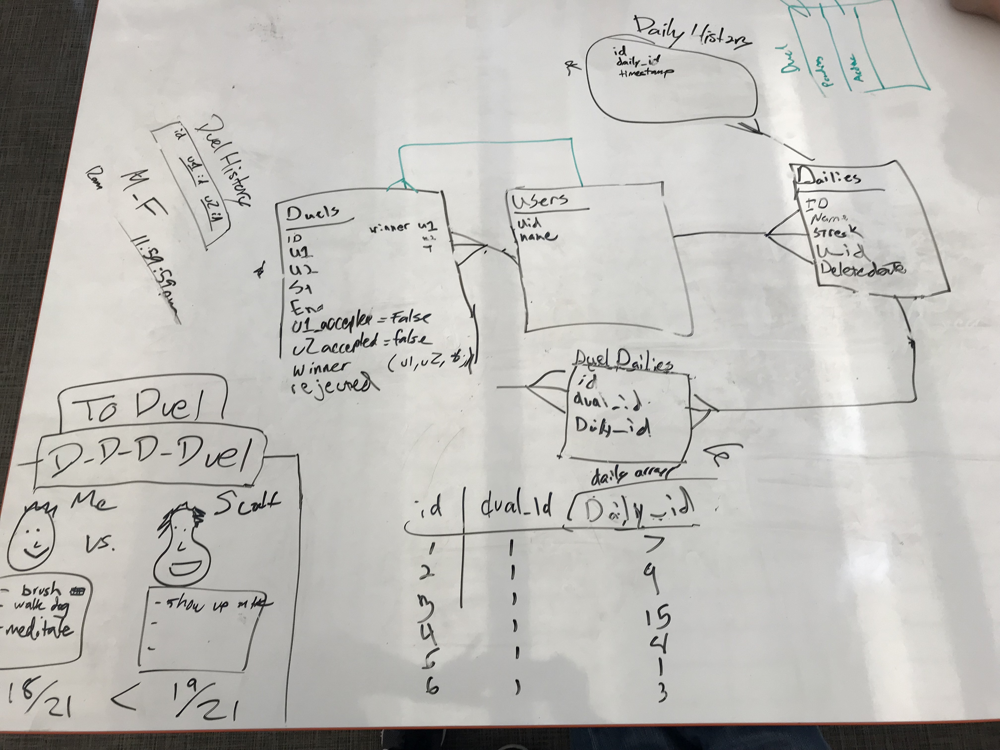

# To Duel Backend

This is the server that is referenced by to-duel-frontend to populate user, daily, and duel information.

## Technologies Used
* Knex
* Express
* PostgreSQL

## Entity Relationship Diagram



**NOTE:** The migrations and seeds for the `snacks` table are included. You will need to implement the `users` and `reviews` tables yourself following this relationship diagram.

## Routes

| Request Method | Request URL | Request Body | Response Status | Response Body                                                  |
|----------------|-------------|--------------|-----------------|----------------------------------------------------------------|
| `POST`         | `/api/users`           | `{ "first_name": "Linus", "last_name": "Torvalds", "email": "linus.torvalds@hotmail.com", "password": "ilovelinux" }` | `200`           | `{ id: 2, "first_name": "Linus", "last_name": "Torvalds", ... } |


## Setup

Start by forking and cloning this repo.
Then install all dependencies

```shell
cd to-duel-backend
npm install
```

Create the databases:

```shell
createdb to_duel_dev
```

and run migrations and seeds:

```shell
npm run knex migrate:latest
npm run knex seed:run
```

Start the server:

```shell
npm run dev
```
